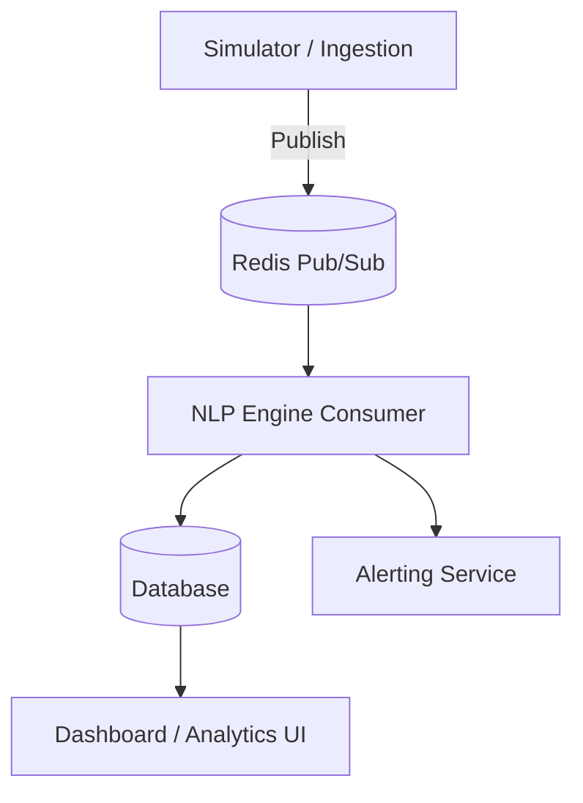

# 🌊Sentinel: Real-Time Social Media Analytics for Coastal Hazard Detection

This project is a real-time analytics platform designed to detect and analyze coastal hazards by monitoring social media platforms. It simulates social media data, processes it in real-time to identify hazard alerts, and provides a live dashboard for situational awareness.

## 📌 Problem Statement

Coastal regions in India are highly vulnerable to a variety of natural disasters, including floods, cyclones, tsunamis, erosion, and heavy rainfall. During these events, social media platforms like Twitter, Facebook, and YouTube become critical sources of first-hand information, with people sharing updates, rumors, and calls for help.

**The challenge lies in:**

-   **Filtering Signal from Noise**: Differentiating genuine hazard alerts from irrelevant content, humor, or false alarms.
-   **Detecting Discussion Spikes**: Identifying sudden increases in conversations about hazards in specific coastal areas.
-   **Providing Timely Warnings**: Delivering real-time early warnings and situational awareness to authorities and the public.

## 🎯 Our Solution

We are developing a real-time analytics platform that performs the following functions:

1.  **Simulates Social Media Data**: Generates realistic social media posts, as access to real-time APIs is often restricted or paid.
2.  **Streams Data in Real-Time**: Uses a message broker (Redis) to stream posts as they are generated.
3.  **Processes with an NLP Engine**: An NLP engine consumes the posts and classifies them into:
    -   ✅ **Hazard Alerts**
    -   ⚠️ **False Alarms / Misinformation**
    -   ❌ **Noise / Humor / Pranks**
4.  **Extracts Key Information**: Identifies the type of hazard and the location mentioned in the posts.
5.  **Visualizes and Alerts**: Displays the results on a live dashboard and triggers alerts when risk levels in a particular area spike.

## 🛠️ System Architecture

-   **Simulator / Ingestion**: Generates realistic, multilingual posts simulating hazards, noise, and false alarms.
-   **Redis Pub/Sub**: A lightweight message broker that facilitates real-time data streaming.
-   **NLP Engine**: Filters, classifies, and extracts entities from the incoming posts.
-   **Database**: Stores the processed data for analysis and visualization.
-   **Dashboard**: Visualizes hazard alerts, maps, and user engagement metrics.

## ✨ Key Features

#### 🔹 Simulator

-   **Multi-Platform Simulation**: Generates posts for Twitter, Facebook, Instagram, YouTube, and news portals.
-   **Human-like Content**: Creates realistic content, including casual reports, rumors, and code-switching (e.g., Hindi-English-Marathi).
-   **Diverse Post Types**: Simulates hazard alerts, noise/jokes, and false alarms.
-   **Simulates Misinformation**: Randomly attaches images, sometimes mismatched, to simulate the spread of false information.
-   **Rich Metadata**: Adds metadata such as follower counts, likes, shares, and user verification status.

#### 🔹 Streaming

-   **Real-Time Flow**: Uses Redis Pub/Sub for an efficient, real-time message stream.
-   **Decoupled Architecture**: Separates the data producer (simulator) from the consumer (NLP engine).

#### 🔹 NLP Engine

-   **Hazard Detection**: Identifies the type of hazard (e.g., flood, cyclone, tsunami).
-   **Location Extraction**: Uses NER (Named Entity Recognition) to extract locations from posts.
-   **Noise Filtering**: Filters out irrelevant content, humor, and pranks.
-   **Misinformation Flagging**: Identifies and flags potential false alarms.

#### 🔹 Dashboard & Alerts

-   **Live Visualization**: Provides a real-time view of incoming hazard posts.
-   **Heatmaps**: Displays heatmaps for coastal locations with high hazard-related activity.
-   **Spike Detection**: Implements early warning systems by detecting spikes in hazard discussions.
-   **Notifications**: Sends alerts through console notifications.

## ⚡ Tech Stack

-   **Data Simulation**: Python
-   **Streaming**: Redis Pub/Sub
-   **NLP Engine**: Python, Regex/NER, with optional LLM few-shot classification
-   **Database**: SQLite / PostgreSQL / Elasticsearch
-   **Dashboard**: Streamlit / Grafana / FastAPI

## 🚀 Future Scope

-   **Integrate Real APIs**: Replace the simulator with real data from APIs like the YouTube Data API, Reddit, and News RSS feeds.
-   **Scale with Kafka**: Migrate from Redis to Kafka for more robust, enterprise-scale deployments.
-   **Add Computer Vision**: Incorporate computer vision to analyze images and videos for evidence of disasters.
-   **Integrate with Official Systems**: Connect with official disaster alert systems for government and public use.

## 📊 Demo Flow

1.  The simulator generates multilingual posts about hazards and noise.
2.  These posts are streamed in real-time into Redis.
3.  The NLP engine processes the posts as they arrive.
4.  The dashboard updates live to show the latest hazard detections.
5.  Alerts are triggered if there is a spike in disaster-related chatter.

## 💡 Impact

-   **Early Situational Awareness**: Provides timely awareness of developing coastal hazards.
-   **Filters Misinformation**: Helps to filter out rumors, false alarms, and memes.
-   **Multilingual Support**: Designed to work in the multilingual context of India.
-   **Scalable Architecture**: The prototype is hackathon-ready but is built on an architecture that can be scaled to real-world systems.
